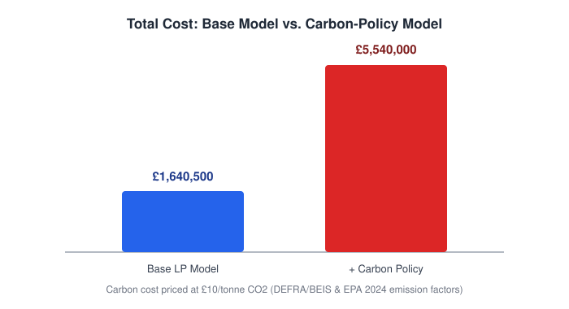

# Supply Chain Distribution Optimisation (Linear Programming)

Minimising distribution cost across a multi-product, multi-echelon supply
network — 4 factories, 4 warehouses, 6 retailers — using linear programming
in Excel Solver, then extending the model with a **carbon cost policy** to
compare cost-only vs. cost-and-emissions-aware distribution plans.


## The problem

A manufacturer produces 3 products across 4 factories and needs to get them
to 6 retailers — either shipping **directly**, or **via one of 4
warehouses**. Every route has a different unit transport cost. The question:

> *What quantity of each product should travel on each possible route, to
> minimise total transportation cost while meeting every factory's
> capacity, every warehouse's capacity and flow balance, and every
> retailer's demand?*

This is a classic **transhipment problem** — a network-flow LP with three
tiers of nodes and three types of edges.


## Approach

- **Formulation**: decision variables for each of the three flow types
  (factory→warehouse, factory→retailer, warehouse→retailer), one objective
  function summing transport cost across all routes, and constraints for
  capacity, demand, and warehouse flow balance.
- **Solver**: Excel's Solver add-in (Simplex LP method).
- **Validation**: Solver's Answer Report to confirm feasibility, and
  Sensitivity Report to interpret shadow prices and reduced costs.
- **Extension**: re-run the model with a carbon cost added to the objective
  function, using published emission factors and a per-tonne CO2 price, to
  see how the optimal plan shifts once environmental cost is priced in.

## Results

| Model | Total cost |
|---|---|
| Base LP model | **£1,640,500** |
| + Carbon cost policy | **£5,540,000** |



**Base model highlights**
- Direct factory → retailer shipments (£610,750) beat routing through
  warehouses (£1,029,750 combined) on cost, even though the warehouse route
  carried more total volume.
- Factory 3 was the busiest supplier into warehouses; Warehouse 4 was the
  busiest outbound hub.
- Warehouse 3 came out underused — spare capacity for future demand growth.
- Sensitivity analysis: some unused routes were nowhere close to viable
  (e.g. Factory 1 → Warehouse 4 needed a £2.55/unit cost cut to enter the
  solution), while others (Factory 3's Product 3 capacity) had zero shadow
  price, meaning extra capacity there wouldn't reduce cost at all.

**With carbon cost added**
- The plan leaned even harder into direct factory → retailer shipments and
  almost abandoned factory → warehouse routing.
- Total cost rose ~3.4x, but the solver still found the cheapest *combined*
  (transport + carbon) plan rather than just the lowest-emission one —
  demonstrating the classic cost/sustainability trade-off in network design.

## Repo structure

```
.
├── README.md
├── docs/
│   └── report.md              ← full written report (formulation, results, sensitivity analysis, carbon policy)
├── assets/
│   ├── network_diagram.svg
│   ├── cost_breakdown.svg
│   └── carbon_policy_comparison.svg
└── distribution_LP_model_solution.xlsx
```

 **Full report**: [`docs/report.md`](docs/report.md) — the complete write-up with the LP
formulation, constraint definitions, results discussion, sensitivity
analysis, and the carbon-policy extension in detail.

### Inside the workbook

| Sheet | Contents |
|---|---|
| `Question 2` | Base LP model — variables, cost matrix, constraints |
| `Question 2- Answer Report` | Solver Answer Report (base model) |
| `Question 2-Sensitivity Report` | Solver Sensitivity Report — shadow prices & reduced costs |
| `Question 3` | Carbon-policy-adjusted LP model |
| `Question 3 - Answer Report` | Solver Answer Report (carbon model) |
| `Question 3 -Sensitivity Report` | Solver Sensitivity Report (carbon model) |

## Reproducing it

1. Open `distribution_LP_model_solution.xlsx` in Excel.
2. Enable the **Solver** add-in (`File → Options → Add-ins → Solver
   Add-in`).
3. Go to `Data → Solver` on either the `Question 2` or `Question 3` sheet —
   the objective cell, variable cells, and constraints are already set up.
4. Click **Solve** to reproduce the optimal plan, then **Solver → Reports**
   to regenerate the Answer/Sensitivity reports.

## Notes 

- The carbon emission factors and £10/tonne CO2 price are illustrative
  assumptions (based on published DEFRA/BEIS, EPA, IMF and PwC figures), not
  a specific regulatory carbon price.
- This was built as a learning exercise in management science / operations
  research modelling — shared here to show the formulation and Solver
  workflow, not as production supply-chain software.

## License

Shared for educational reference. Feel free to learn from the approach.
please don't submit it as your own coursework.
