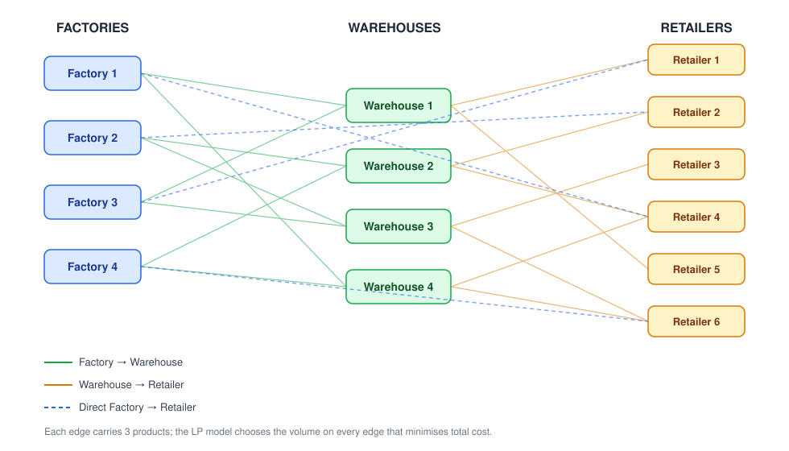
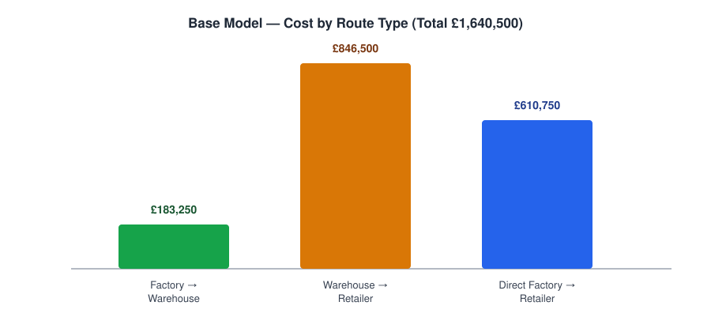

# Supply Chain Distribution Optimisation (Linear Programming)

This project addresses a multi-product, multi-echelon supply chain distribution problem involving 4 factories, 4 warehouses, and 6 retailers. A linear programming model was developed in Microsoft Excel Solver to determine the optimal distribution plan across direct and warehouse-based transportation routes.

The analysis is conducted in two stages:

- Supply Chain Optimisation — minimising total transportation costs while satisfying factory capacity, warehouse capacity, retailer demand, and flow-balance constraints.
- Carbon Policy Extension — incorporating carbon costs into the optimisation model to compare a traditional cost-minimising distribution plan with a cost-and-emissions-aware alternative.

The project demonstrates how optimisation modelling can support supply chain decisions by evaluating the trade-off between operational cost efficiency and environmental sustainability.

## The problem

A manufacturing company operates four factories, four warehouses and six retailers.

The company needs to decide:

- How much of each product should be shipped?
- Which factories should supply which retailers?
- Which warehouses should be used?
- Whether direct or indirect routes are more cost-effective.

The optimisation model determines the lowest-cost distribution plan while ensuring that all operational constraints are satisfied.

The model allows both:

- Factory → Retailer
- Factory → Warehouse → Retailer

---




## Approach

- **Formulation**: decision variables for each of the three flow types
  (factory→warehouse, factory→retailer, warehouse→retailer), one objective
  function summing transport cost across all routes, and constraints for
  capacity, demand, and warehouse flow balance.
- **Solver**: Excel's Solver add-in (Simplex LP method).
- **Validation**: Solver's Answer Report to confirm feasibility, and
  Sensitivity Report to interpret shadow prices and reduced costs.
- **Extension**: re-run the model with a carbon cost added to the objective
  function, using published emission factors and a per-tonne CO2 price, to
  see how the optimal plan shifts once environmental cost is priced in.

## Results

The base model landed on a total distribution cost of **£1,640,500**, split
across the three route types:



**Key takeaways from the base model**
- Direct factory → retailer shipments (£610,750) beat routing through
  warehouses (£1,029,750 combined) on cost, even though the warehouse route
  carried more total volume.
- Factory 3 was the busiest supplier into warehouses; Warehouse 4 was the
  busiest outbound hub.
- Warehouse 3 came out underused — spare capacity for future demand growth.
- Sensitivity analysis: some unused routes were nowhere close to viable
  (e.g. Factory 1 → Warehouse 4 needed a £2.55/unit cost cut to enter the
  solution), while others (Factory 3's Product 3 capacity) had zero shadow
  price, meaning extra capacity there wouldn't reduce cost at all.

### Adding a carbon cost policy

Re-running the model with a carbon cost added to every route's price pushed
total cost up to **£5,540,000**:


The revised model didn't just cost more — it changed the distribution
strategy itself, by weighing both financial and environmental cost together
rather than cost alone.

**Key findings from the carbon-aware model**
- Prioritised routes based on *combined* financial and carbon cost, not
  transport cost alone.
- Changed which routes were attractive — some previously competitive routes
  became uneconomical once carbon cost was added.
- Reduced the use of indirect (warehouse-routed) shipments in favour of
  direct factory-to-retailer routes.
- Demonstrated how sustainability considerations can meaningfully alter the
  optimal supply chain configuration.

**Cost-only vs. carbon-aware optimisation**

The two models answer different business questions:

| Model | Primary objective |
|---|---|
| Baseline Model | Minimise transportation cost |
| Carbon Policy Model | Minimise transportation cost **plus** carbon cost |

The comparison shows that the most cost-efficient distribution plan can
change once environmental costs enter the optimisation objective — a
reminder that supply chain decisions often need to weigh more than one
business objective at once.

## Business insights

- **Direct distribution can reduce cost.** Direct factory-to-retailer
  transportation is often more economical where route costs are favourable,
  since it avoids the extra transportation stage warehouses introduce.
- **Warehouses provide strategic flexibility.** Even where warehouse-based
  routes cost more, warehouses give the network extra capacity and
  alternative routing options that a purely direct network wouldn't have.
- **The optimal solution depends on the objective.** A cost-minimising
  supply chain can produce a meaningfully different distribution plan from
  one that also accounts for environmental cost.
- **Optimisation supports trade-off analysis.** Linear programming lets
  decision-makers evaluate the trade-off between cost efficiency and
  environmental sustainability directly, rather than guessing at it.

## Full report

See **[REPORT.md](REPORT.md)** for the complete write-up: full LP formulation
with all constraint equations, detailed results, sensitivity analysis, and
the carbon-policy extension explained in depth.

## Repo structure

```
.
├── README.md
├── docs/
│   └── report.md              ← full written report (formulation, results, sensitivity analysis, carbon policy)
├── assets/
│   ├── network_diagram.svg
│   ├── cost_breakdown.svg
│   └── carbon_policy_comparison.svg
└── distribution_LP_model_solution.xlsx
```

### Inside the workbook

| Sheet | Contents |
|---|---|
| `Base Model` | Base LP model — variables, cost matrix, constraints |
| `Base Model- Answer Report` | Solver Answer Report (base model) |
| `Base Model-Sensitivity Report` | Solver Sensitivity Report — shadow prices & reduced costs |
| `Carbon Policy Model` | Carbon-policy-adjusted LP model |
| `Carbon Policy Model - Answer Report` | Solver Answer Report (carbon model) |
| `Carbon Policy Model -Sensitivity Report` | Solver Sensitivity Report (carbon model) |

## Reproducing it

1. Open `distribution_LP_model_solution.xlsx` in Excel.
2. Enable the **Solver** add-in (`File → Options → Add-ins → Solver
   Add-in`).
3. Go to `Data → Solver` on either the `Question 2` or `Question 3` sheet —
   the objective cell, variable cells, and constraints are already set up.
4. Click **Solve** to reproduce the optimal plan, then **Solver → Reports**
   to regenerate the Answer/Sensitivity reports.

## Notes 

- The carbon emission factors and £10/tonne CO2 price are illustrative
  assumptions (based on published DEFRA/BEIS, EPA, IMF and PwC figures), not
  a specific regulatory carbon price.
- This was built as a learning exercise in management science / operations
  research modelling — shared here to show the formulation and Solver
  workflow, not as production supply-chain software.

## License

Shared for educational reference. Feel free to learn from the approach.
please don't submit it as your own coursework.
